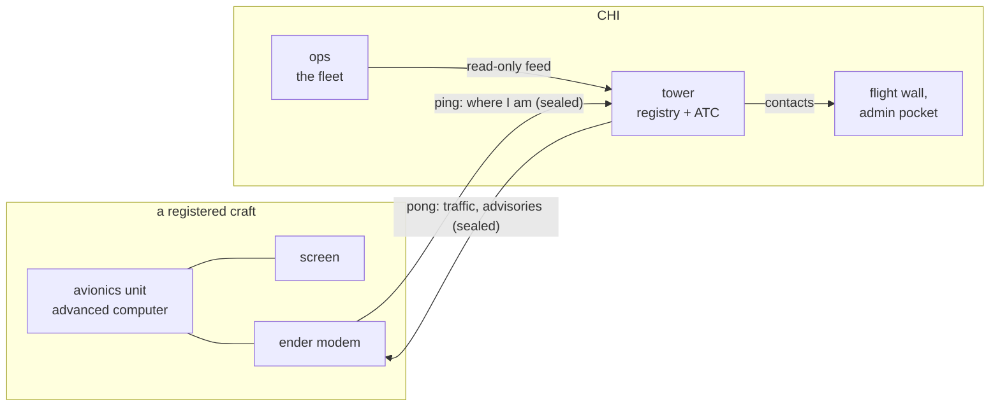

# CINDER NAV and the traffic service

Alex, 2026-10-01: every vehicle on the server - aircraft, land vehicles,
boats and submarines - can carry a CINDER unit: an advanced computer, one
screen and an ender modem, **supplied by CINDER** and registered with it.
CINDER hosts the service and answers every unit's ping. Registration is
**heavily encouraged**, not required, and it is what makes traffic control
possible. It is a consumer product: CINDER's look and voice, a screen anyone
can read at a glance.

**Built 2026-10-01, not yet run in game:** `nav.lua` (the unit),
`tower.lua` (the tower), `lib/nav.lua` (shared), `lib/navui.lua` (the
unit's screen). Tested end to end on the desktop: `tools/run_nav_test.py`,
`tools/run_navnet_test.py`; `tools/preview_nav.py` renders the screen.
Steps 1 to 3 of the traffic control below are in, 6 and 7 in part.

## Setting it up

**What pulls and what pushes (Alex, 2026-10-01).** Every computer in the
traffic service updates itself from the repo on boot, and pulls only its own
role's files, never the whole repo. Only the **master tower** - inside
CINDER's claims, where nobody else can get at it - carries the shared
`common` files (uploads, the machine folder, key tools), so it is the only
one that can push. Units and display-only centres are BARE roles
(`startup.lua` BARE): their own files and nothing else, no token, nothing
that uploads, and startup never touches a thruster or a redstone output on
them.

**The master tower** - an advanced computer of its own inside CINDER's
claims, with an ender modem, a disk drive and an advanced monitor 3x3 or
bigger for the radar (any smaller one shows the board):

```
wget run https://raw.githubusercontent.com/antrathent-sys/Chill-Grill-DroneNet/main/startup.lua role tower
label set tower
tower here CHI <x> <y> <z>
tower range 2000
reboot
```

`tower here` is the tower's own name and place (F3), so its radar is centred
on it and every unit is told where it is; `tower range` is the radar's outer
ring. It autoruns `tower` from then on. To register while it runs: press a
key during `autorun: tower in 3 s` for the shell, `bg tower` to run it in a
tab of its own, and `tower register` in this one. `tower list`, `tower show
CR-0001`, `tower revoke CR-0001`, `tower log`.

**More traffic centres** - display only, anywhere (Alex, 2026-10-01: every
ping still goes to the master). Role `centre`, not `tower`: the first
command with `role centre`, then put the centre's computer (or a floppy for
it) in the master's drive and run `tower centre add NORTH 1200 80 -400`;
with a floppy, `tower join` on the centre. It shows the master's picture
centred on itself - the same radar and board - and answers no one. The
master feeds each centre a sealed picture every 2 seconds; a centre that
stops hearing it says `NO FEED FROM MASTER`. Every unit is told where all
the centres are. `tower centre list`, `tower centre drop NORTH`.

Every tower and centre shows the other centres inside its range ring: a
green cross with the name on the radar, and a `CENTRES` line on the board
(nearest first, distance and direction). The board gives every vehicle's
X and Z beside its height - on the computer's own screen too.

**A unit** - an advanced computer. Place it once, turn it on and `label set
nav-new`, then break it: labelled, it keeps its files as an item. Put it in
the master's disk drive, sit the owner in the tower's seat, and run `tower
register`. It reads the owner's name off the seat, asks the registrar to
confirm it, then asks the vehicle type (air, land, sea, sub) and a callsign,
and writes the
unit's software, its key, its registration and the tower's own `startup.lua`
with role `nav`, labels it and ejects it. On the vehicle it needs an
advanced monitor (any size; one block works, a 2x1 strip is the intended
one) and an ender modem beside it; turn it on once and it runs by itself
from then on. Every boot it pulls its own files from the repo behind the
CINDER NAV boot screen and goes straight into the instruments: nothing about
the update is shown to the owner, there is no shell (Ctrl+T does nothing),
no token and nothing that pushes. A new key or a new registration still
comes from the master's drive - `tower register` again keeps its key.

**Registration kiosks** (Alex, 2026-10-02: players register their own
vehicles, the kit comes with the registration, and a kiosk is a computer of
its own wherever players are - the HQ lobby first). The master tower stays
the one registry: it decides the callsign, the limit and the number, and
keeps every unit's key. A kiosk asks it over the radio, sealed with the
kiosk's own key, and is answered alone; the new unit's key comes back once,
sealed, to be written onto the unit (`navdesk.lua`, logic
`lib/navkiosk.lua`, screens `lib/kioskui.lua`).

A kiosk, all on its own computer's wired network:

- an advanced computer with an ender modem placed on it;
- a touch monitor - an advanced monitor 3x2 or bigger (4x3 gives a
  full-size keyboard);
- the seat: a Create Seat, a Display Link on it reading Entity Name, a
  CC:C Bridge target block;
- a disk drive;
- **stock**: one chest or several (one per part works - Alex's booth has a
  chest each for computers, monitors and modems) on CINDER's side, filled
  with advanced computers that
  have been **placed and switched on once** (a disk drive can only read a
  computer that has; no label needed), advanced monitors and ender modems;
- an **out chest** the seated player can open.

**The prep turtle** does the switching on (`navprep.lua`): a mining turtle
sitting on the computers' stock chest, with a chest on top of it for new
computers from the crafting table. It takes one from the top, places it in
front, switches it on, digs it back up and drops it into the stock below -
one every couple of seconds. The first command with `role prep`, keep the
block in front of it clear, reboot; it runs by itself from then on.

Setting one up:

1. On the kiosk's computer: the first command with `role kiosk`.
2. Break it, put it in the **master tower's** drive, and on the master:
   `tower kiosk add HQ`. That writes the kiosk's name and key onto it.
   (A floppy works too: then `navdesk join` on the kiosk with the floppy in
   its drive.)
3. Put it back, wire everything up, and run `navdesk setup`: it finds the
   monitor, drive and seat and asks which chest is the stock and which the
   out chest. Reboot; it runs `navdesk` by itself from then on.

On the master: `tower kiosk list` (each kiosk, its kits in stock, when it
was last heard - the tower's board says when one runs out), `tower kiosk
drop HQ`.

**Open, for testing** (Alex, 2026-10-02: "disable the key for now"):
`tower kiosk open` on the master and it also answers kiosks that have no
key, in the clear - skip step 2, and the kiosk goes by its computer's label
(`label set kiosk-hq` makes it HQ) and says NO KEY when it starts. While it
is open a new unit's key crosses the air unsealed and any computer could
ask to register, so `tower kiosk closed` (the default) before it is in
players' hands, and give each kiosk its key then.

The player:

1. sits down - the kiosk greets them by name, which is the owner;
2. touches REGISTER A CRAFT (it says when equipment is out of stock);
3. touches the vehicle type - AIRCRAFT, LAND VEHICLE, VESSEL, SUBMARINE,
   each with the gauge it will get;
4. types a callsign on the screen's keyboard - **refused if another live
   unit has it ("TAKEN BY CR-0007"), or if it starts CINDER, LAMBDA, ZETA,
   TOWER or ATC** (N.callFree, decided by the master);
5. checks owner, type, callsign and registration, and touches REGISTER.
   The kiosk moves a computer from the stock into its drive (one the drive
   cannot read goes back), the master files the unit and sends its key, the
   kiosk writes it (if that fails, the master takes it back out), and the
   unit, two advanced monitors and an ender modem go into the out chest.

Their own unit put in the drive offers UPDATE (software, same key) or
CHANGE (type and callsign, same registration; the master checks it is
theirs); it comes back in the out chest. Anything else in the drive is to
be taken out first. Five units per player at a kiosk (`N.KIOSK_MAX`);
more at the tower. Getting up for three seconds, or ninety seconds without
a touch part-way through, starts again. A kiosk that cannot reach the
master says THE REGISTRY CANNOT BE REACHED.

**Hosting a traffic centre** (Alex, 2026-10-02: "a way to apply for an
ATC"). The kiosk's other button: the centre's name (2 to 12 letters,
digits or dashes), where it would stand (X and Z), and APPLY. One waiting
application per player; a name already a centre or applied for is
refused. Applications go to `centreapps.csv` on the master (through the kiosk's link) and its board
shows each as it arrives. `tower centre apps` lists the waiting ones,
`tower centre approve <n>` approves one and prints the `tower centre add`
to run with the centre's computer in the drive, `tower centre refuse
<n>`.

## The pieces



| piece | what it is | holds |
|---|---|---|
| **Avionics unit** | an advanced computer on the craft, with a screen and an ender modem, running `avionics` | its own key, its registration, the program |
| **Tower** | a computer of its own at CHI running `tower`: the registry, the air picture, ATC | every unit's key; **never** a fleet key |
| **Ops** | unchanged | the fleet's keys; gives the tower our units through the read-only feed it already has |

The tower is its own computer for two reasons. It is the public face, so it
must hold nothing that can fly a CINDER unit: if it is compromised, the
fleet is not. And a busy sky should never slow the base that dispatches the
fleet.

## Ping and pong

Every couple of seconds the unit sends one sealed report - its **ping**:

- exact position, height, heading, speed and climb, from Sable
  (`sublevel.getLogicalPose`, `getLinearVelocity`), or GPS off a craft;
- the craft's Sable name and unique id;
- its state: flying, parked, distress.

The tower answers with a sealed **pong**, for that unit only:

- traffic near it: callsign, bearing, distance, height difference, closing
  or not;
- any advisory: traffic to avoid, a zone being entered, a message from
  CINDER;
- whether the tower is hearing it at all, so the screen can say so.

Both directions are sealed with the unit's own key (`lib/seclink.lua`), so
nobody can pose as a registered craft, and nobody can send a pilot a false
warning in CINDER's name.

**The one rule that does not bend:** a pong is information. The avionics
program has no code that touches a thruster, a redstone output or anything
else on the craft, and the owner can read every line of it. Nothing CINDER
sends can ever fly somebody else's craft.

## What the owner sees

The unit is a CINDER product and looks like one (`lib/tui.lua`, the brand
book): cold, capitals, no shell for a casual owner. `tools/preview_nav.py`
renders every page.

**Screens and pages (Alex, 2026-10-01).** Every advanced monitor fitted to the
unit shows one page, and a touch anywhere but SOS moves it to the next. Each
screen keeps its own page (saved on the unit, kept through restarts and
updates), so one screen can cycle through everything, or four can be speed,
height, radar and status for good. A new screen starts one page along from
the screens before it. Monitors side by side merge into one; separate screens
need a gap, or a wired modem to reach the computer.

| page | on a one-block screen (15x10) |
|---|---|
| speed | speed big, heading under it (aircraft, vessel, submarine) |
| altimeter | **an aircraft's gauge** (2026-10-02): a dial whose long needle goes round once per 100 blocks and short one once per 1,000, Y in figures in the dial, the climb under it |
| speedometer | **a land vehicle's gauge**: a 270-degree dial whose full scale grows with the speed (20, 40, 80, 160, 320 b/s), the speed in figures |
| compass | **a vessel's gauge**: north up, N E S W round the ring, the needle on the heading, the point in words |
| depth | **a submarine's gauge**: once round per 100 blocks below sea level, the depth in figures, SURF at the surface |
| height | height (Y level) big and climb - on a land vehicle |
| heading | heading big and the compass point in words (aircraft, land vehicle, submarine) |
| radar | **very simple**: a ring at 1 km, you in the middle, a dot for each vehicle (rust if it is on course to pass too close), a green dot for each traffic centre; your heading at the top |
| status | callsign, type, tower link, traffic, the nearest centre with its distance and direction |

**It teaches itself** (Alex, 2026-10-02). While something is missing, every
screen shows SET UP with each problem and what to do: NO ENDER MODEM - put
one on the computer; NOT ON A VEHICLE - place the computer on your craft; NO
TOUCH SCREEN - SOS needs an advanced monitor. A screen that has never been
touched says TAP (TOUCH when wide) where its page number goes, until it is
touched once (`.navtaught`). The computer's own screen lists the same, with
the fix beside each, and how the screens and SOS work.

A screen 30 or more wide starts on the overview (speed and height side by
side; on a panel, the traffic list) and cycles through the same pages. Every
page keeps the tower link and the SOS key on its bottom row, and an advisory
across the row above, shortened to fit (`TFC 12H 310` on one block).

- **Distress:** two touches on SOS, on any screen. The tower raises it, logs
  it and acknowledges it (`SOS HEARD`); nearby units are told.

## Registration, and what CINDER collects

Done at the tower, the way passes are made: the unit's computer goes in the
disk drive and comes out with the program, a key of its own and its
registration written to it.

**At registration**, typed by whoever registers it:

| field | |
|---|---|
| registration | `CR-0001` for now - **a placeholder**: the format is still to be agreed with people. Records keep only the sequence number, so changing `N.REG_FORMAT` in `lib/nav.lua` renames every unit at once |
| unit id | `nav-0001`: its label and the name its key is filed under, fixed for life whatever the registration looks like |
| owner | **read off the seat beside the tower** (Alex, 2026-10-02): a Create Seat, a Display Link on it with the "Entity Name" source, aimed at a CC:C Bridge target block on the tower's computer - the only thing in this pack that names a real player to a computer. The registrar confirms the name (a mob in the seat reads as a word too). With no seat fitted the name is typed, and the record says `typed` |
| type | aircraft, land vehicle, vessel or submarine |
| callsign | what traffic calls it, chosen by the owner |
| issued, by | the date, and the tower that issued it |

**From the unit, automatically**, every ping:

| field | |
|---|---|
| position, height, speed, heading, climb | the live picture; the registry keeps the last of each |
| state | moving, standing, distress |
| vehicle | Sable's id, name and mass, as last heard - for reference only. Players pack craft into containers and put them out again, which makes a new one each time, so nothing depends on it |
| first and last heard | dates |

**In the log** (`navlog.csv` on the tower, one line per event, rolled at
256 KB): registered, first contact, departed, arrived, distress and
distress over, updated, revoked - each with
the time, the registration, the callsign and the position. Never one line
per ping. The long record belongs outside the game (SERVICE.md).

The unit's own screen says it reports its position to CINDER. Cold, not
covert.

Revoking a unit (`tower revoke`) deletes its key: a running tower stops
answering it within ten seconds.

## Traffic control, in the order it is built

1. **The picture.** Every registered vehicle on the tower's radar (3x3 or
   bigger, north up, each vehicle a dot with a 30-second heading line and its
   callsign, distress in red, other centres in green) and board, with
   last-seen for anything away - **built**, on the master and on any number
   of display-only centres it feeds. **CINDER's own units too** (2026-10-02):
   the master tower is a public watcher on the base's read-only feed
   (`seckey watch new tower` on the base, `seckey watch set disk` on the
   tower, labelled `tower`). It is told only where each unit is and how it
   moves - no jobs, customers or routes - and shows them as CINDER, by name
   (LAMBDA-001); every nav unit gets them as traffic. **Stealth**: `ops
   stealth on` on the base and the tower is told nothing about CINDER's
   units, so no tower, centre or nav unit shows them; the tower's own
   screens say CINDER HIDDEN. `ops stealth off` ends it. No drone code
   changed. The picture on the flight wall and the admin pocket - not yet.
2. **Traffic on every screen.** Each pong carries what is within 1,000
   blocks of that vehicle - **built**.
3. **Advisories.** Pairs that would pass within 40 blocks inside 30 seconds,
   at about the same height, get a warning each - **built**
   (`TRAFFIC 2 O'CLOCK 300 SAME LEVEL`), and anyone in distress nearby is
   called out.
4. **Flight levels by heading.** Eastbound odd hundreds, westbound even: the
   screen shows the right level for the current heading. Free separation
   for everybody.
5. **Control zones.** A radius round CHI and each depot: registered craft
   are told on entry, and CINDER units have priority there.
6. **Distress to recovery.** The distress key raises it on the tower,
   which acknowledges it on the unit's screen and logs it - **built**.
   Sending a CINDER unit to it - not yet.
7. **Records.** Departures, arrivals, distress and vehicle changes per
   registration, written sparsely - **built** (`navlog.csv`). Where from
   and where to as named places, and the long record outside the game -
   not yet.

## Limits to design round

- **Vehicles come and go.** A craft packed into a container takes its unit
  with it: the unit goes quiet, and the tower shows it **AWAY** with when it
  was last heard - never an alarm. Put out again, the unit starts by itself
  and carries on under the same registration. Keep the surface simple
  (Alex, 2026-10-01): nothing the player does with the craft should need
  anything doing at the tower.

- **Unregistered craft are invisible.** There is no radar in Sable or
  Aeronautics (checked in their source): the tower sees exactly the craft
  that report. That is why registration matters, and why a control zone
  can only advise.
- **A unit only runs while its chunk is loaded.** A parked craft with
  nobody near goes quiet; the tower shows it last seen, not lost.
- **Positions are self-reported.** The owner controls the computer. The key
  proves which unit is speaking, not that it is telling the truth; the
  tower flags jumps that no craft could fly.
- **Load.** Dozens of units at one ping every two seconds is light work for
  the tower. Pings go on a channel of their own, not the fleet's telemetry
  channel, so a busy sky never crowds the fleet.
- **Disk.** The registry is small; tracks are written only on change, and
  rotated. The tower's computer has 1 MB like every other.

## Decided, 2026-10-01

- **Distress is manual**, two touches on the screen (Alex: "manual SOS via
  the touchscreen is fine"). It needs an advanced monitor; a plain one
  cannot be touched.
- **Keep the surface simple.** One screen, two big numbers, one key; three
  questions to register; a craft packed away is ordinary.
- **Screens cycle by touch, and each keeps its own page**, so a player can
  fit one or several. The unit's radar is very simple.
- **Several traffic centres**: one master hears every ping; the others are
  display only, and every unit is shown where they are.
- **The tower's radar is a 3x3 monitor at least.**

1. **CINDER supplies the kits.**
2. **Registration is heavily encouraged**, not required.
3. **The registration format** is still to be agreed with people;
   `CR-0001` stands in, and changes in one line.
4. **The tower is its own computer at CHI** (the `tower` role).
5. **Building started now**, as a consumer product under the CINDER brand,
   for every kind of vehicle, not only aircraft.

Still open: **players finding their own craft** (Alex, 2026-10-01: "worth thinking
about how we let players find their crafts on their own") - the tower knows
where each unit was last heard, and an owner has no way to ask it yet;
the tower's picture on the flight wall and the admin pocket, and steps 3
to 7 of the traffic control.
