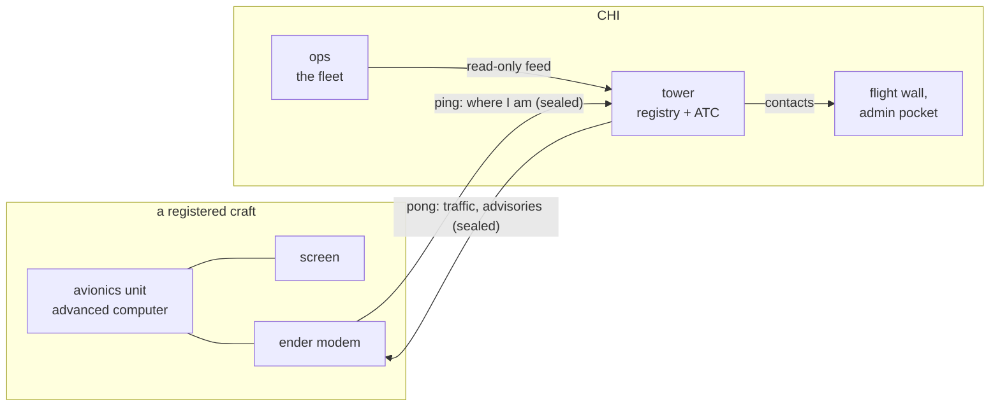

# CINDER avionics and the air traffic service

Proposed 2026-10-01, from Alex: every aero vehicle on the server carries a
CINDER avionics unit - an advanced computer, a screen and an ender modem -
registered with CINDER, which hosts the service and answers every unit's
ping. Registration is what makes air traffic control possible. Nothing here
is built; the decisions still open are listed at the end.

## The pieces

| piece | what it is | holds |
|---|---|---|
| **Avionics unit** | an advanced computer on the craft, with a screen and an ender modem, running `avionics` | its own key, its registration, the program |
| **Tower** | a computer of its own at CHI running `tower`: the registry, the air picture, ATC | every unit's key; **never** a fleet key |
| **Ops** | unchanged | the fleet's keys; gives the tower our units through the read-only feed it already has |

The tower is its own computer for two reasons. It is the public face, so it
must hold nothing that can fly a CINDER unit: if it is compromised, the
fleet is not. And a busy sky should never slow the base that dispatches the
fleet.

## Ping and pong

Every couple of seconds the unit sends one sealed report - its **ping**:

- exact position, height, heading, speed and climb, from Sable
  (`sublevel.getLogicalPose`, `getLinearVelocity`), or GPS off a craft;
- the craft's Sable name and unique id;
- its state: flying, parked, distress.

The tower answers with a sealed **pong**, for that unit only:

- traffic near it: callsign, bearing, distance, height difference, closing
  or not;
- any advisory: traffic to avoid, a zone being entered, a message from
  CINDER;
- whether the tower is hearing it at all, so the screen can say so.

Both directions are sealed with the unit's own key (`lib/seclink.lua`), so
nobody can pose as a registered craft, and nobody can send a pilot a false
warning in CINDER's name.

**The one rule that does not bend:** a pong is information. The avionics
program has no code that touches a thruster, a redstone output or anything
else on the craft, and the owner can read every line of it. Nothing CINDER
sends can ever fly somebody else's craft.

## What the owner sees

The unit is a CINDER product and looks like one (`lib/tui.lua`, the brand
book): cold, capitals, no shell for a casual owner.

- **Instruments:** heading, ground speed, height above sea, climb.
- **Traffic:** a radar circle with contacts by bearing and range, and a
  short list - callsign, distance, height difference, closing.
- **Advisories:** one line, the voice of the brand: `TRAFFIC 2 O'CLOCK 300
  SAME LEVEL`, `ENTERING CHI CONTROL ZONE`.
- **Distress:** one key. The tower raises it on every CINDER screen and a
  unit can be sent to the position (the recovery transit in BRAND.md).
- **Link:** `TOWER CONTACT` or `NO CONTACT`, and the registration.

## Registration

Done at the base, the way passes are made (`provision.lua`): the unit's
computer goes in the disk drive and comes out with the program, a key of its
own and its registration written to it. The registry on the tower holds:

| field | |
|---|---|
| registration | the craft's number for life, e.g. `CR-0001` (format to decide) |
| callsign | what ATC calls it, chosen by the owner |
| owner | the name given at registration (a computer cannot check who a player is) |
| craft | the Sable id it was first heard from - a unit moved to another craft is noticed, and re-registered |
| class | private, freight, CINDER |
| issued, last heard | dates |

Revoking a unit is deleting its line, as with depot keys.

## Air traffic control, in the order it would be built

1. **The air picture.** Every registered craft and every CINDER unit on the
   flight wall, the admin pocket and the tower's own screen, with last-seen
   for anything parked or out of range.
2. **Traffic on every screen.** Each pong carries what is near that craft.
3. **Advisories.** Pairs closing within a set number of seconds get a
   warning each, the craft-to-craft version of what the base already does
   for its own unit.
4. **Flight levels by heading.** Eastbound odd hundreds, westbound even: the
   screen shows the right level for the current heading. Free separation
   for everybody.
5. **Control zones.** A radius round CHI and each depot: registered craft
   are told on entry, and CINDER units have priority there.
6. **Distress to recovery.** The distress key dispatches a unit.
7. **Records.** Every registration's flights - where from, where to, when -
   written sparsely (on arrival, departure and change, never per ping), as
   the logging goal asks. The long record belongs outside the game
   (SERVICE.md).

## Limits to design round

- **Unregistered craft are invisible.** There is no radar in Sable or
  Aeronautics (checked in their source): the tower sees exactly the craft
  that report. That is why registration matters, and why a control zone
  can only advise.
- **A unit only runs while its chunk is loaded.** A parked craft with
  nobody near goes quiet; the tower shows it last seen, not lost.
- **Positions are self-reported.** The owner controls the computer. The key
  proves which unit is speaking, not that it is telling the truth; the
  tower flags jumps that no craft could fly.
- **Load.** Dozens of units at one ping every two seconds is light work for
  the tower. Pings go on a channel of their own, not the fleet's telemetry
  channel, so a busy sky never crowds the fleet.
- **Disk.** The registry is small; tracks are written only on change, and
  rotated. The tower's computer has 1 MB like every other.

## Open decisions

1. **Who supplies the hardware?** CINDER builds and hands out complete kits,
   or owners bring an advanced computer, a screen and an ender modem and
   CINDER registers them.
2. **Is registration required** - to fly in a CINDER zone, to use CINDER
   places, or only encouraged?
3. **The registration format** (`CR-0001`, or a code tied to the place
   codes).
4. **The tower as its own computer at CHI** (recommended above), or a role
   on the base.
5. **When.** It touches no flight code, so it can be built without putting
   the delivery demo at risk; it does add a product while ROADMAP.md asks
   for pruning.
