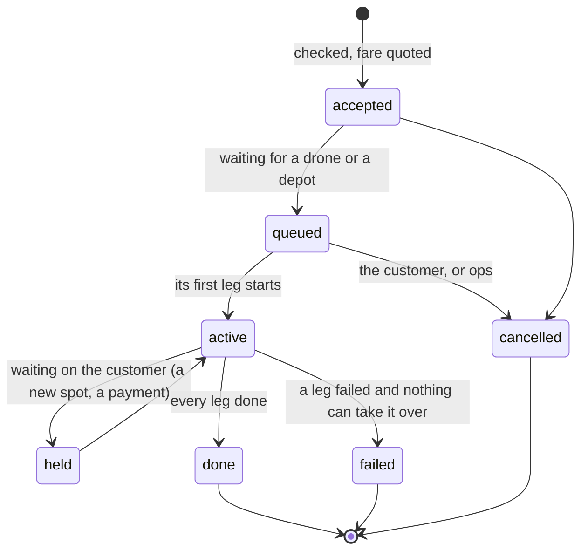

# Orders

How a job for the service is described, checked, run and written down.
Written 2026-09-24 as a proposal: nothing here is built yet. It replaces the
job and load bookkeeping that grew one feature at a time.

## What there is now

Every kind of work keeps its own records, in its own shape, and the live
state is only in the base computer's memory:

| What | While it runs | When it ends |
|---|---|---|
| A ride | `jobs` in ops's memory; the waiting line too | a row in `joblog.csv` |
| A load at a depot | `loads` in ops's memory; new ones in `loads.queue` | rows in `cargo.csv` |
| Money | - | rows in `ledger.csv` |
| Something going wrong | - | a row in `incidents.csv` |

Two consequences:

- **A restart of ops forgets everything in flight.** A drone half way
  through a ride, a load at a depot, the people waiting in line: all gone,
  and the drone and the depot carry on with nobody listening.
- **Nothing ties the records together.** Which ride that fare was for, which
  order that silo belonged to, whether a delivery was ever paid for: each
  has to be matched by time and name.

## The model

Three things, and only three.

**An order** is what somebody asked for, and the promise made to them. One
record, one id, from the moment it is accepted until it is finished.

| Field | |
|---|---|
| `id` | `O` + a number that never repeats on this base (the epoch second and a counter) |
| `kind` | `ride` (a person), `parcel` (goods, from a depot), `restock` (goods, dock to dock) |
| `who` | a pass's name, a walk-up at a depot (`walkup@pier`), or `ops` |
| `from` | a place, or coordinates |
| `to` | one or more drops, each a place or coordinates, in order |
| `cargo` | parcels: what was declared, then what was counted into each silo |
| `fare` | quoted when accepted, charged when it ends (or refunded) |
| `state` | see below |

**A leg** is one thing one machine does towards an order: a drone flies
somewhere, a depot loads a side, a drone drops a silo, a depot unloads one.
An order's plan is its legs, in order, each with the machine that does it:

```
parcel O1758752000.1  alex  from depot pier  to market and farm
  1 ferry    drone-1      home -> pier
  2 load     depot-pier   side A, then side B
  3 deliver  drone-1      silo A at market, silo B at farm
  4 home     drone-1      -> home
```

A ride is the same shape with no depot: fly to the pickup, wait for the
passenger, fly to the destination, home.

**An event** is anything that happens to an order or a leg: accepted,
started, a step reported, finished, failed, charged. Every event is one line
appended to `orders.log`, and that log is the truth. Everything else is
worked out from it.

## States

The same few, for every kind of order:



A leg is simpler: `waiting -> running -> done | failed`. The machine running
a leg reports its steps (the dock's place, fill, push... already do); the
base decides when the leg is done.

## Checks

The base is the only place anything is decided, so it is the only place
anything is checked, and it checks twice.

**When an order is asked for** (and refused with a reason if any fails):

- **Who.** A pass whose sealed request opened, or open mode; a walk-up only
  at a depot, once the depositor has been paid.
- **Where.** Every place is one ops knows, or coordinates inside the world
  border with a ground height. A parcel starts at a dock that has a depot.
- **What.** It fits: two silos of 60 stacks (7,680 of a 64-stack item), and
  at most one drop per silo.
- **Money.** The fare is quoted; the balance covers it, or it is paid first.
- **Once.** The request's nonce has not been seen: a repeat gets the order
  already made, not a second one.

**When each leg is about to start** - because a lot can change while an order
waits in line:

- **The drone.** Heard from in the last 15 s, not in distress, docked where
  the leg starts, and enough energy for the leg plus a reserve.
- **The depot.** Awake (a hello in the last 15 s); for a load, the side's
  bay clear and its storage holding the goods; for an unload, the side's
  bay clear to take the silo.
- **The payload.** The drone holds a silo for every drop it is about to make.

A leg that fails a check does not start: the order goes back to `queued` (the
drone may be free later) or to `failed` with the reason.

## Where it is kept

- **`orders.log`** on the base: one line per event,
  `when,order,leg,event,key=value;key=value`, appended and never rewritten.
  On boot ops reads it back and rebuilds every order that has not ended.
- **`ledger.csv` stays as it is.** Money gets its own record, written in one
  place, with the order id in the note. It must stay simple to check.
- **`joblog.csv`, `cargo.csv`, `incidents.csv`** keep being written for now,
  so nothing that reads them breaks. Later they can be worked out from
  `orders.log` instead.
- **Machines keep only their own state** (`.dockstate`, `.depotstate`) and
  report it; the base's log is the record.
- **Space.** A computer holds 1 MB. Finished orders are folded into one
  summary line each when the log passes a size, and the full log is pushed
  to the repo with `upload`, the way flight logs are.

## After a restart

For every order still open in the log, ops asks the machines on its legs
before doing anything:

- The drone's telemetry says where it is and whether it is docked or flying.
- The depot's hello says whether a load was under way (it already reports
  this) and what its sensors see in each bay.

Then each leg is resumed, or marked failed with what was found. A leg that
may already have happened - a load the depot says is done, a silo already
dropped - is never run a second time.

## Building it

Small steps, each tested on the desktop before it goes near a drone:

1. **`lib/orders.lua`**, pure: the order and leg states, the checks, the log
   line format, and rebuilding from the log.
2. **Rides go through it.** ops writes `orders.log` for the flow that already
   works, and picks it up again after a restart. Nothing new for customers.
3. **Parcels.** `ops order parcel <from depot> <to> [and <to>]` makes an order
   whose legs the board runs: ferry, load (the dock sequence, answered by the
   base instead of `depot seq`'s "taken as done"), deliver, home.
4. **`ops orders`**: what is open, what each leg is doing, what ended and why.

## Decisions for Alex

- **Who can make a parcel order?** Only ops, walk-ups at a depot, passes, or
  all three?
- **When is a parcel paid for?** When it is accepted, when it is loaded, or
  when it is delivered?
- **A delivery that cannot be made** (no clear drop, a drone in distress):
  bring it back to the depot it came from, drop it at the base, or keep it on
  the drone until ops decides?
- **How long the base keeps finished orders** before only the summary is
  left.
