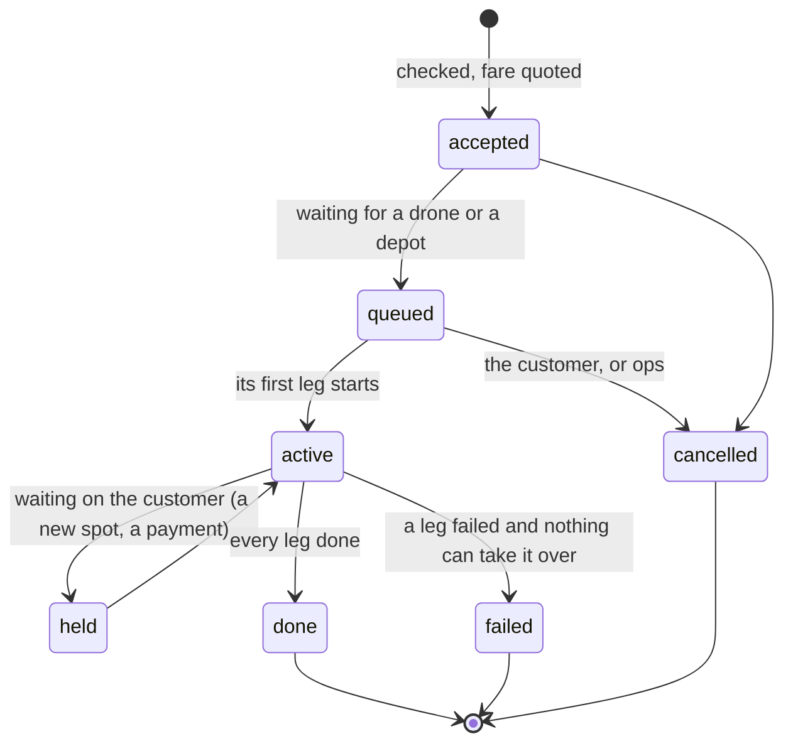

# Orders

How a job for the service is described, checked, run and written down.
Written 2026-09-24 as a proposal: nothing here is built yet. It replaces the
job and load bookkeeping that grew one feature at a time.

## What there is now

Every kind of work keeps its own records, in its own shape, and the live
state is only in the base computer's memory:

| What | While it runs | When it ends |
|---|---|---|
| A ride | `jobs` in ops's memory; the waiting line too | a row in `joblog.csv` |
| A load at a depot | `loads` in ops's memory; new ones in `loads.queue` | rows in `cargo.csv` |
| Money | - | rows in `ledger.csv` |
| Something going wrong | - | a row in `incidents.csv` |

Two consequences:

- **A restart of ops forgets everything in flight.** A drone half way
  through a ride, a load at a depot, the people waiting in line: all gone,
  and the drone and the depot carry on with nobody listening.
- **Nothing ties the records together.** Which ride that fare was for, which
  order that silo belonged to, whether a delivery was ever paid for: each
  has to be matched by time and name.

## Taking an order today

Decided 2026-09-28: orders arrive by word of mouth, and Alex takes them. A
customer messages on Discord, Alex agrees a price, and **types the order into
the base**. There is no website, no bot and no form yet.

The rule that makes that worth building properly: **an order typed in by hand
and an order that arrives from a website later must be the same record.**
Everything downstream - loading, flying, the drop, the charge, the log - reads
the record and never asks how it got there. So when a form or a bot turns up,
it calls the same `orders.add()` Alex's command does, and nothing past that line
changes.

The whole flow, as it runs now:

1. A customer asks: *10k cobble to 1200 70 340.*
2. Alex quotes it. `ops quote` does the arithmetic so every quote is made the
   same way: how many runs, how far, how long each takes, a suggested charge.
3. He agrees a price and enters it: `ops order add`.
4. The base checks it, writes it to `orders.log`, and works out the runs.
5. It flies them when a drone and the depot are free: ferry to the depot, load,
   drop at the coordinates, home - once per run.
6. Money arrives however it arrives (in person, a bank transfer). Alex marks
   it: `ops order paid`. Paying is a fact about the order, not something the
   base has to collect.
7. He tells the customer it is done. That stays manual too, for now.

Steps 1-3 and 7 are the only manual ones, and they are the only ones a website
or a bot would ever replace.

### The commands

```
ops quote <amount> <item> to <x> <y> <z>
ops order add <who> <amount> <item> to <x> <y> <z> for <price>
ops orders                      open orders, runs done and to go
ops order <id>                  one order, every event
ops order paid <id> [note]      money received
ops order cancel <id> <why>
```

`who` is free text - a Discord name, an MC name - because nobody has a pass for
this. The order id is what Alex quotes back to the customer.

### What a run is

Every silo is a **shipment**, and a silo gives one of its 60 slots to its
invoice (DELIVERIES.md): **3,776 of a 64-stack item** a shipment, 944 of a
16-stack one, 59 of something that does not stack. The dual loader fills two at
once, so a flight carries two shipments. 10k cobble is three shipments on two
flights, and the customer receives three vaults marked 1 of 3, 2 of 3 and
3 of 3. `ops orders` shows how many are done.

Each run takes about **64 s + distance / 171** in the air (PERFORMANCE.md), plus
the load at the depot. That is the number `ops quote` puts in front of Alex, so a
customer can be told how long 10k takes, not only what it costs.

### Delivered where

A delivery is a **drop**: the drone holds over the coordinates and lets the
silo go. It never lands, so the rule that keeps passengers to platforms does
not apply - coordinates are fine. What it does need is the **ground height**:
the silo is released `DROP_ALT` above the ground, and a wrong y means it falls
from too high or the drone flies into the ground. So an order takes all three
of x, y and z, as F3 shows them, the same as the pocket's typed coordinates.

## Running it from the Cinder side

The commands above are for testing and for scripts. Taking real orders on them
means typing `ops order add steve 10000 cobble to 1200 70 340 for 1500` with a
customer waiting, and a typo in the coordinates costs a flight. So the order
book gets screens, in the same style as the control board - a masthead, a list
with a selection bar, a detail panel, a log, one key per action - and the same
screens run on the base and on Alex's pocket, so an order can be taken where
he is when the message arrives.

Five rules make it friendly:

1. **Pick, don't type.** Every field that can be a list is one: customers who
   have ordered before, the items we sell, each customer's last address and the
   saved places. Typing is the fallback for something new.
2. **The machine does the arithmetic.** Shipments, flights, flight time and a
   suggested price appear as the form fills in, before anything is committed.
3. **Show exactly what will happen before it happens.** A confirm page with the
   plan and the first invoice as it will print. ENT accepts.
4. **One key per action** on the orders list: new, run, paid, invoice, cancel.
5. **Say what to do, not what went wrong.** "The intake has 900 iron and
   shipment 2 needs 1,200 - top it up, then R" rather than a code.

### The orders board

A second page of the control board; TAB switches between the fleet and this.
A mockup - not drawn yet:

```
===================  ORDERS  ===================
06:12   3 OPEN   1 LOADING   1,500 SPUR UNPAID
 ORDER   FOR     WHAT          SHIPPED | C-0042
>C-0042  STEVE   COBBLE 10K    2 OF 3  | STEVE
 C-0043  KODIAK  IRON 1.2K     LOADING | 10,000 COBBLESTONE
 C-0041  UN      GRAVEL 5K     DONE    | TO 1200 70 340
                                       | 1,500 SPUR UNPAID
 LOG                                   | NEXT 3 OF 3, 2,448
 0610 C-0042 SHIPMENTS 1-2 DROPPED
 0611 C-0043 LOADING SIDE A
 0611 C-0043 INTAKE SHORT - 900 IRON, NEEDS 1,200
 N NEW  R RUN  P PAID  I INVOICE  TAB FLEET  Q QUIT
```

The status line is the three things that need Alex: what is open, what is
moving, and what is owed. An order that needs him - an intake short, a load
stuck, delivered and still unpaid - is drawn in the warning colour and the
board chimes once.

### A new order, five steps

Each step is a list with the likely answer already selected, so a repeat
customer ordering the usual is five presses of ENT.

```
NEW ORDER                              WHO   1 / 5
>STEVE           LAST 1200 70 340   3 ORDERS
 KODIAK          LAST 2400 72 -3269 1 ORDER
 UN              LAST 1285 93 -22   2 ORDERS
 + SOMEONE NEW
 ENT PICK   TYPE TO SEARCH   Q BACK
```

1. **Who.** Customers from the orders log, most recent first, with their last
   address. Or someone new: a name.
2. **What.** The items on the price list, then anything the intake holds now.
3. **How many.** Typed, and answered with the shipment arithmetic as you type:
   `10,000 = 3 shipments on 2 flights. 11,328 would fill them.`
4. **Where.** The customer's last address first, then the saved places, then
   coordinates typed as F3 shows them - all three, because a drop needs the
   ground height.
5. **Price.** The suggestion from the price list is already filled in; ENT
   takes it, or type another.

### Confirm

```
CONFIRM                                  C-0044
 STEVE        10,000 COBBLESTONE
 TO           1200 70 340   2,850 FROM FACTORY
 SHIPMENTS    3, ON 2 FLIGHTS
 FLYING       ABOUT 4 MIN   (64 S + D/171, x2)
 PRICE        1,500 SPUR    SUGGESTED 1,420
 ----------------------------------------------
 FIRST INVOICE PRINTS AS C-0044-1, 1 OF 3
 ENT ACCEPT   E EDIT   Q CANCEL
```

On a screen wide enough (a monitor), the first invoice is drawn beside it
exactly as it will print - `lib/invoice.lua` already makes the lines.

After ENT, the screen shows the reply to send the customer, word for word, so
it is the same every time:

```
C-0044 CONFIRMED. 10,000 COBBLESTONE TO 1200 70 340.
3 SHIPMENTS. 1,500 SPUR. CARGO AT CONSIGNEE'S RISK.
```

### The price list: machines/base/prices.lua

The suggested price needs something to suggest from, and a config file on the
base is the simplest thing that works (kept in the base's machine folder, like
its places):

```lua
return {
  -- what we sell: spurs per 1,000, and the stack size if it is not 64
  cobble      = { per1k = 120 },
  gravel      = { per1k = 150 },
  iron_block  = { per1k = 9000 },
  ender_pearl = { per1k = 20000, stack = 16 },
  -- delivery on top of the goods: spurs per 1,000 blocks from the factory
  delivery    = { per1kBlocks = 100 },
}
```

The same file is the supply list the website will show later, so it is written
once. What we sell is whatever is in it; the form offers nothing else unless
the intake happens to hold it.

### Who remembers what

Nothing new is stored for any of this. Customers, their last address and what
they owe are all read back out of `orders.log`; the items and prices come from
`prices.lua`; places from `pads.lua`. The screens are a view of the order book,
not a second record of it.

### One order book, several front doors

`lib/orders.lua` holds the rules and the log; the actions - add, run, paid,
cancel, quote - are functions on it. The commands, the base screens, the
pocket and, one day, the web Cinder side in SERVICE.md all call those same
functions. So a new front door is only ever drawing, never logic, and the
command line stays for testing and scripts.

## The model

Three things, and only three.

**An order** is what somebody asked for, and the promise made to them. One
record, one id, from the moment it is accepted until it is finished.

| Field | |
|---|---|
| `id` | `C-` and a number one past the highest in `orders.log`: `C-0042`. Short, because customers quote it off their invoice. It cannot repeat while the log survives, and the log is pushed to the repo with `upload` |
| `kind` | `ride` (a person), `parcel` (goods, from a depot), `restock` (goods, dock to dock) |
| `who` | a pass's name, a walk-up at a depot (`walkup@pier`), or `ops` |
| `from` | a place, or coordinates |
| `to` | one or more drops, each a place or coordinates, in order |
| `item` | parcels: what was ordered, by the name the depot sees |
| `amount` | parcels: how many, and so how many runs |
| `cargo` | parcels: what was counted into each silo, run by run |
| `price` | agreed with the customer when the order is taken |
| `paid` | when the money arrived and a note of how - set by hand |
| `fare` | rides: quoted when accepted, charged when it ends |
| `state` | see below |

**A leg** is one thing one machine does towards an order: a drone flies
somewhere, a depot loads a side, a drone drops a silo, a depot unloads one.
An order's plan is its legs, in order, each with the machine that does it:

```
parcel O1758752000.1  alex  from depot pier  to market and farm
  1 ferry    drone-1      home -> pier
  2 load     depot-pier   side A, then side B
  3 deliver  drone-1      silo A at market, silo B at farm
  4 home     drone-1      -> home
```

A ride is the same shape with no depot: fly to the pickup, wait for the
passenger, fly to the destination, home.

**An event** is anything that happens to an order or a leg: accepted,
started, a step reported, finished, failed, charged. Every event is one line
appended to `orders.log`, and that log is the truth. Everything else is
worked out from it.

## States

The same few, for every kind of order:


```mermaid
stateDiagram-v2
  [*] --> accepted: checked, fare quoted
  accepted --> queued: waiting for a drone or a depot
  queued --> active: its first leg starts
  active --> held: waiting on the customer (a new spot, a payment)
  held --> active
  active --> done: every leg done
  active --> failed: a leg failed and nothing can take it over
  queued --> cancelled: the customer, or ops
  accepted --> cancelled
  done --> [*]
  failed --> [*]
  cancelled --> [*]
```

A leg is simpler: `waiting -> running -> done | failed`. The machine running
a leg reports its steps (the dock's place, fill, push... already do); the
base decides when the leg is done.

## Checks

The base is the only place anything is decided, so it is the only place
anything is checked, and it checks twice.

**When an order is asked for** (and refused with a reason if any fails):

- **Who.** A pass whose sealed request opened, or open mode; a walk-up only
  at a depot, once the depositor has been paid.
- **Where.** Every place is one ops knows, or coordinates inside the world
  border with a ground height. A parcel starts at a dock that has a depot.
- **What.** It fits: two silos of 60 stacks (7,680 of a 64-stack item), and
  at most one drop per silo.
- **Money.** The fare is quoted; the balance covers it, or it is paid first.
- **Once.** The request's nonce has not been seen: a repeat gets the order
  already made, not a second one.

**When each leg is about to start** - because a lot can change while an order
waits in line:

- **The drone.** Heard from in the last 15 s, not in distress, docked where
  the leg starts, and enough energy for the leg plus a reserve.
- **The depot.** Awake (a hello in the last 15 s); for a load, the side's
  bay clear and its storage holding the goods; for an unload, the side's
  bay clear to take the silo.
- **The payload.** The drone holds a silo for every drop it is about to make.

A leg that fails a check does not start: the order goes back to `queued` (the
drone may be free later) or to `failed` with the reason.

## Where it is kept

- **`orders.log`** on the base: one line per event,
  `when,order,leg,event,key=value;key=value`, appended and never rewritten.
  On boot ops reads it back and rebuilds every order that has not ended.
- **`ledger.csv` stays as it is.** Money gets its own record, written in one
  place, with the order id in the note. It must stay simple to check.
- **`joblog.csv`, `cargo.csv`, `incidents.csv`** keep being written for now,
  so nothing that reads them breaks. Later they can be worked out from
  `orders.log` instead.
- **Machines keep only their own state** (`.dockstate`, `.depotstate`) and
  report it; the base's log is the record.
- **Space.** A computer holds 1 MB. Finished orders are folded into one
  summary line each when the log passes a size, and the full log is pushed
  to the repo with `upload`, the way flight logs are.

## After a restart

For every order still open in the log, ops asks the machines on its legs
before doing anything:

- The drone's telemetry says where it is and whether it is docked or flying.
- The depot's hello says whether a load was under way (it already reports
  this) and what its sensors see in each bay.

Then each leg is resumed, or marked failed with what was found. A leg that
may already have happened - a load the depot says is done, a silo already
dropped - is never run a second time.

## Building it

Small steps, each tested on the desktop before it goes near a drone:

Parcels first now, because that is what word of mouth sells; rides already
work and can move over afterwards. Build it against the message contract in
[SERVICE.md](SERVICE.md): `ops order add` makes an `order.new` exactly as a
service outside the game would send one, so if the business ever moves out
of Minecraft, nothing here changes but where that message comes from.

1. **`lib/orders.lua`**, pure: the record, the checks, the log line format,
   runs from an amount, and rebuilding every open order from the log.
2. **The order book.** `ops order add`, `ops orders`, `ops order <id>`,
   `ops order paid`, `ops order cancel`, and `ops quote`. Useful the day it
   exists even with nothing flying it: Alex can take orders, track them and
   see what is unpaid, and fly runs with the commands he has now.
3. **Flying it.** An open order's runs become legs the board runs: ferry, load
   (the dock sequence, answered by the base instead of `depot seq`'s "taken as
   done"), drop, home. One run at a time.
4. **Rides go through it too**, so a base restart stops forgetting them.

## Decisions

- **Who can make a parcel order?** **Ops only**, for now (Alex, 2026-09-28):
  orders come by word of mouth and Alex enters them. Walk-ups and passes can
  follow once the order book exists; they would call the same `orders.add()`.
- **When is a parcel paid for?** Payment happens outside the system, so the
  order records it rather than collecting it: `ops order paid` when it
  arrives. Whether Alex wants it before the first run or after the last is his
  to say each time; `ops orders` shows what is unpaid either way.
- **A delivery that cannot be made** (no clear drop, a drone in distress):
  *open.* Proposed: the drone keeps the silo and brings it back to the depot
  it came from, and the order goes to `held` until Alex decides.
- **How long the base keeps finished orders** before only the summary is
  left: *open.* Proposed: every finished order is pushed to the repo with
  `upload` and folded to one line when `orders.log` passes 200 KB.
