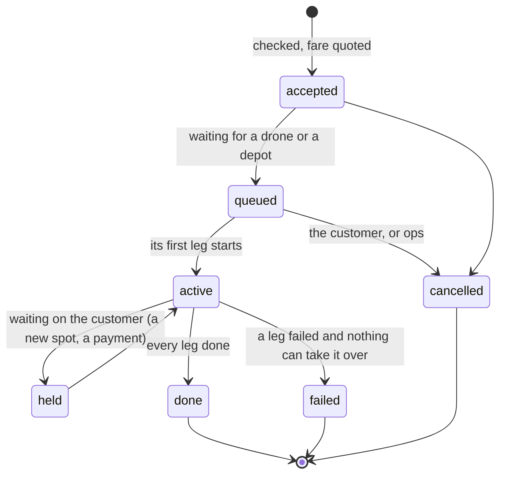

# Orders

How a job for the service is described, checked, run and written down. For the
whole path an order takes, from the message to the last drop, read
[WORKFLOW.md](WORKFLOW.md) first.
Written 2026-09-24 as a proposal: nothing here is built yet. It replaces the
job and load bookkeeping that grew one feature at a time.

## What there is now

Every kind of work keeps its own records, in its own shape, and the live
state is only in the base computer's memory:

| What | While it runs | When it ends |
|---|---|---|
| A ride | `jobs` in ops's memory; the waiting line too | a row in `joblog.csv` |
| A load at a depot | `loads` in ops's memory; new ones in `loads.queue` | rows in `cargo.csv` |
| Money | - | rows in `ledger.csv` |
| Something going wrong | - | a row in `incidents.csv` |

Two consequences:

- **A restart of ops forgets everything in flight.** A drone half way
  through a ride, a load at a depot, the people waiting in line: all gone,
  and the drone and the depot carry on with nobody listening.
- **Nothing ties the records together.** Which ride that fare was for, which
  order that silo belonged to, whether a delivery was ever paid for: each
  has to be matched by time and name.

## Taking an order today

Decided 2026-09-28: orders arrive by word of mouth, and Alex takes them. A
customer messages on Discord, Alex agrees a price, and **types the order into
the base**. There is no website, no bot and no form yet.

The rule that makes that worth building properly: **an order typed in by hand
and an order that arrives from a website later must be the same record.**
Everything downstream - loading, flying, the drop, the charge, the log - reads
the record and never asks how it got there. So when a form or a bot turns up,
it calls the same `orders.add()` Alex's command does, and nothing past that line
changes.

The whole flow, as it runs now:

1. A customer asks: *10k cobble to 1200 70 340.*
2. Alex quotes it. `ops quote` does the arithmetic so every quote is made the
   same way: how many runs, how far, how long each takes, a suggested charge.
3. He agrees a price and enters it: `ops order add`.
4. The base checks it, writes it to `orders.log`, and works out the runs.
5. It flies them when a drone and the depot are free: ferry to the depot, load,
   drop at the coordinates, home - once per run.
6. Money arrives however it arrives (in person, a bank transfer). Alex marks
   it: `ops order paid`. Paying is a fact about the order, not something the
   base has to collect.
7. He tells the customer it is done. That stays manual too, for now.

Steps 1-3 and 7 are the only manual ones, and they are the only ones a website
or a bot would ever replace.

### The commands

```
ops quote <amount> <item> [<amount> <item> ...] to <x> <y> <z>
ops order add <who> <amount> <item> [<amount> <item> ...] to <x> <y> <z> for <price>
ops orders                      open orders, shipments done and to go
ops order <id>                  one order, every event
ops order paid <id> [note]      money received by hand
ops order cancel <id> <why>
```

`who` is free text - a Discord name, an MC name - because nobody has a pass for
this. The order id is what Alex quotes back to the customer. Commands only, for
now (Alex, 2026-09-28): screens were drawn up and set aside.

**Several items in one order** are just more pairs before `to`:

```
ops order add kodiak 5000 cobble 2000 gravel 640 iron_block to 2400 72 -3269 for 2400
```

Items are named the way the catalogue knows them (below): the id, the id
without its namespace, or the display name with underscores - and the
catalogue carries each one's stack size, so ender pearls pack as 16s without
being told. Something not in the catalogue is refused, with what it might have
meant. And if a stack size is ever wrong, nothing breaks: the depot knows every
item's real stack size when it moves it, and each flight is planned from what
was actually counted.

### The catalogue

What Cinder supplies is **whatever is in the reference inventories at the
base** (Alex, 2026-09-28): one of each item, in a chest, a vault, or a row of
either. Adding a product is dropping one in; dropping one is taking it out.

```
ops catalogue read minecraft:chest_5 create:item_vault_9    the first time
ops catalogue read                                          after that - same inventories
ops catalogue                                               what we supply
ops catalogue find ender pearl                              what an order would take that to mean
```

Reading them gives every item's **exact id** - modded namespaces included, no
typos - its **display name** and its **stack size**, straight from the game.
Duplicates count once, so the same item in two chests is one line. The result
is `catalogue.lua`, kept in the repo as `machines/base/catalogue.lua` the same
way the base keeps its places, and put back by `startup` on every boot. From
there `tools/schematic.py` on the desktop quotes a customer's build against it,
and it is the catalogue a website or a Discord post would show later.

Two things it cannot tell apart: items that differ only inside - enchanted
books with different enchantments, potions - are one entry, by id. And a name
two mods both use (`andesite`) is not guessed at: `find` offers both, and the
full id settles it.

### From a schematic

Alex's idea (2026-09-28): a customer sends the Create schematic (`.nbt`) of what
they want to build, and we quote the part we can supply. A schematic is every
block placed, so the whole bill of materials is in it:

```
python tools/schematic.py build.nbt --who steve --to 1200 70 340
```

It lists every item the build takes, splits it into **what we supply** and
**what to source elsewhere**, and prints the `ops order add` line for our part,
ready to paste. The first one tried was a small aircraft: 604 blocks, 1,264
items of 32 kinds, and 640 of those - concrete powder, wool, andesite, glass -
are the kind of thing a factory sells; the rest are engines, thrusters and
copycats.

Blocks are not items one for one, and the tool knows the common cases: a door
or a bed is two blocks and one item, a double slab one block and two slabs, a
wall torch is a torch, water is nothing to buy, three candles in a block are
three candles. **Copycats are two things**: the copycat, and the block it is
disguised as - and the disguise is where the materials hide. In that aircraft
289 light grey concrete powder and 272 black wool were never placed as blocks
at all; they were painted onto copycats. The schematic keeps what each copycat
consumed (`Item` on Create's, `consumedItem` per part on Copycats+ ones), so
they are counted exactly.

What it cannot see: anything inside a block (a chest's contents, an engine's
fuel, a redstone link's frequency items), items that differ only by their data
(dyed, enchanted, named - counted by kind alone), and a schematic saved without
block data, which loses every copycat's material. Create's own schematic and
quill saves it. Belts are flagged for a check by hand, since a belt is laid from
belt items by length rather than block by block.

**What we supply is the catalogue** (above): the tool reads
`machines/base/catalogue.lua` from the repo by itself, shows each item by its
catalogue name, and counts slots with the real stack sizes. `--supply` takes
another catalogue or a plain list instead. The tool is desktop-only: a Discord
attachment lands on Alex's PC, not in the game. Customers' schematics are
theirs and stay out of this public repo.

### What a run is

Every silo is a **shipment**, and a silo gives one of its 60 slots to its
invoice (DELIVERIES.md): **3,776 of a 64-stack item** a shipment, 944 of a
16-stack one, 59 of something that does not stack. The dual loader fills two at
once, so a flight carries two shipments. 10k cobble is three shipments on two
flights, and the customer receives three vaults marked 1 of 3, 2 of 3 and
3 of 3. `ops orders` shows how many are done.

**Several items pack in the order given.** Each item takes whole slots, a
part-stack included, and fills a silo until it runs out or the silo is full,
then the next item starts where it stopped. So a silo holds one item where it
can, and two where one runs out part way: 5,000 cobble and 2,000 gravel is
3,776 cobble in the first silo, and 1,224 cobble with the 2,000 gravel in the
second. `lib/invoice.lua` does this as `I.pack`, and the invoice for a
several-item order is a packing list of what is in that silo (DELIVERIES.md).

Each run takes about **64 s + distance / 171** in the air (PERFORMANCE.md), plus
the load at the depot. That is the number `ops quote` puts in front of Alex, so a
customer can be told how long 10k takes, not only what it costs.

### Delivered where

A delivery is a **drop**: the drone holds over the coordinates and lets the
silo go. It never lands, so the rule that keeps passengers to platforms does
not apply - coordinates are fine. What it does need is the **ground height**:
the silo is released `DROP_ALT` above the ground, and a wrong y means it falls
from too high or the drone flies into the ground. So an order takes all three
of x, y and z, as F3 shows them, the same as the pocket's typed coordinates.

## Parked: screens for the Cinder side

A set of screens for the order book - an orders page beside the fleet page, a
five-step new-order form, a confirm page - was drawn up on 2026-09-28 and set
aside: "not feeling it, leave it to commands for now." It is in git history
(1ecf892) if the idea comes back. What survives from it is the principle that
the commands and anything drawn later call the same functions in
`lib/orders.lua`, so the order book never has two ways of doing one thing.

## Paying against an invoice

Alex's idea (2026-09-28): the invoice that rides in every silo is also how the
customer pays. It solves the till's oldest problem. A Numismatics depositor
only ever says *someone paid* - never who, never for what - which is why the
ride till has to be armed for a customer from their sealed pocket first. An
invoice says what is being paid for, by itself.

### A till

A chest anyone can open, read by a computer at a Cinder location. The customer
puts in the invoice, and pays one of two ways:

- **Card.** Their Numismatics card goes in beside the invoice. The computer
  reads the order number off the invoice's name (`CINDER INVOICE C-0042-2`),
  reads the card's account and authorisation from its item details
  (`numismatics.card`), and has the bank terminal transfer **exactly the
  balance due** into Cinder's account. Nothing more, and the receipt says what
  it took.
- **Coins.** The coins go in instead. The computer counts them by type - spur
  1, bevel 8, sprocket 16, cog 64, crown 512, sun 4096 - and moves them to the
  vault. **No change is given:** anything over the balance is held as credit
  on their name for the next order. Cold corporation.

Then the order is marked paid or part-paid, a receipt is printed into the
chest, and the customer takes their card, their invoice and the receipt back
out. `ops order paid` stays for money that arrives any other way.

### Why nobody has to be identified

The invoice says **what** is being paid; the card or the coins say **how
much**. The till never needs to know who is standing at it.

**Forgery gets nobody anything.** Any CC printer can make a page called
`CINDER INVOICE C-0042-2`, and all it lets the forger do is pay someone else's
bill. An invoice for an order that does not exist, or is already paid, is
refused and nothing is taken.

**Trust is the honest cost of the card path.** A card in a strange chest hands
its authorisation to whatever computer reads it, and a customer has only
Cinder's word that the till takes the balance and no more. Coins need no trust
at all, which is why both exist.

### Proven in game first

1. A printed page's title reads back as its item name through
   `getItemDetail` - the whole scheme rests on this.
2. The coin items' names, from a chest with one of each in it.
3. A card shows `numismatics.card` when it sits in a chest a computer reads.
4. The bank terminal's `transfer` works from a computer given a card's account
   and authorisation.

## The model

Three things, and only three.

**An order** is what somebody asked for, and the promise made to them. One
record, one id, from the moment it is accepted until it is finished.

| Field | |
|---|---|
| `id` | `C-` and a number one past the highest in `orders.log`: `C-0042`. Short, because customers quote it off their invoice. It cannot repeat while the log survives, and the log is pushed to the repo with `upload` |
| `kind` | `ride` (a person), `parcel` (goods, from a depot), `restock` (goods, dock to dock) |
| `who` | a pass's name, a walk-up at a depot (`walkup@pier`), or `ops` |
| `from` | a place, or coordinates |
| `to` | one or more drops, each a place or coordinates, in order |
| `lines` | parcels: what was ordered - one or more items and how many of each, by the names the depot sees |
| `cargo` | parcels: what was counted into each silo, run by run |
| `price` | agreed with the customer when the order is taken |
| `paid` | when the money arrived and a note of how - set by hand |
| `fare` | rides: quoted when accepted, charged when it ends |
| `state` | see below |

**A leg** is one thing one machine does towards an order: a drone flies
somewhere, a depot loads a side, a drone drops a silo, a depot unloads one.
An order's plan is its legs, in order, each with the machine that does it:

```
parcel O1758752000.1  alex  from depot pier  to market and farm
  1 ferry    drone-1      home -> pier
  2 load     depot-pier   side A, then side B
  3 deliver  drone-1      silo A at market, silo B at farm
  4 home     drone-1      -> home
```

A ride is the same shape with no depot: fly to the pickup, wait for the
passenger, fly to the destination, home.

**An event** is anything that happens to an order or a leg: accepted,
started, a step reported, finished, failed, charged. Every event is one line
appended to `orders.log`, and that log is the truth. Everything else is
worked out from it.

## States

The same few, for every kind of order:


```mermaid
stateDiagram-v2
  [*] --> accepted: checked, fare quoted
  accepted --> queued: waiting for a drone or a depot
  queued --> active: its first leg starts
  active --> held: waiting on the customer (a new spot, a payment)
  held --> active
  active --> done: every leg done
  active --> failed: a leg failed and nothing can take it over
  queued --> cancelled: the customer, or ops
  accepted --> cancelled
  done --> [*]
  failed --> [*]
  cancelled --> [*]
```

A leg is simpler: `waiting -> running -> done | failed`. The machine running
a leg reports its steps (the dock's place, fill, push... already do); the
base decides when the leg is done.

## Checks

The base is the only place anything is decided, so it is the only place
anything is checked, and it checks twice.

**When an order is asked for** (and refused with a reason if any fails):

- **Who.** A pass whose sealed request opened, or open mode; a walk-up only
  at a depot, once the depositor has been paid.
- **Where.** Every place is one ops knows, or coordinates inside the world
  border with a ground height. A parcel starts at a dock that has a depot.
- **What.** It fits: two silos of 60 stacks (7,680 of a 64-stack item), and
  at most one drop per silo.
- **Money.** The fare is quoted; the balance covers it, or it is paid first.
- **Once.** The request's nonce has not been seen: a repeat gets the order
  already made, not a second one.

**When each leg is about to start** - because a lot can change while an order
waits in line:

- **The drone.** Heard from in the last 15 s, not in distress, docked where
  the leg starts, and enough energy for the leg plus a reserve.
- **The depot.** Awake (a hello in the last 15 s); for a load, the side's
  bay clear and its storage holding the goods; for an unload, the side's
  bay clear to take the silo.
- **The payload.** The drone holds a silo for every drop it is about to make.

A leg that fails a check does not start: the order goes back to `queued` (the
drone may be free later) or to `failed` with the reason.

## Where it is kept

- **`orders.log`** on the base: one line per event,
  `when,order,leg,event,key=value;key=value`, appended and never rewritten.
  On boot ops reads it back and rebuilds every order that has not ended.
- **`ledger.csv` stays as it is.** Money gets its own record, written in one
  place, with the order id in the note. It must stay simple to check.
- **`joblog.csv`, `cargo.csv`, `incidents.csv`** keep being written for now,
  so nothing that reads them breaks. Later they can be worked out from
  `orders.log` instead.
- **Machines keep only their own state** (`.dockstate`, `.depotstate`) and
  report it; the base's log is the record.
- **Space.** A computer holds 1 MB. Finished orders are folded into one
  summary line each when the log passes a size, and the full log is pushed
  to the repo with `upload`, the way flight logs are.

## After a restart

For every order still open in the log, ops asks the machines on its legs
before doing anything:

- The drone's telemetry says where it is and whether it is docked or flying.
- The depot's hello says whether a load was under way (it already reports
  this) and what its sensors see in each bay.

Then each leg is resumed, or marked failed with what was found. A leg that
may already have happened - a load the depot says is done, a silo already
dropped - is never run a second time.

## Building it

Small steps, each tested on the desktop before it goes near a drone:

Parcels first now, because that is what word of mouth sells; rides already
work and can move over afterwards. Build it against the message contract in
[SERVICE.md](SERVICE.md): `ops order add` makes an `order.new` exactly as a
service outside the game would send one, so if the business ever moves out
of Minecraft, nothing here changes but where that message comes from.

1. **`lib/orders.lua`**, pure: the record, the checks, the log line format,
   runs from an amount, and rebuilding every open order from the log.
2. **The order book.** `ops order add`, `ops orders`, `ops order <id>`,
   `ops order paid`, `ops order cancel`, and `ops quote`. Useful the day it
   exists even with nothing flying it: Alex can take orders, track them and
   see what is unpaid, and fly runs with the commands he has now.
3. **Flying it.** An open order's runs become legs the board runs: ferry, load
   (the dock sequence, answered by the base instead of `depot seq`'s "taken as
   done"), drop, home. One run at a time.
4. **Rides go through it too**, so a base restart stops forgetting them.

## Decisions

- **Who can make a parcel order?** **Ops only**, for now (Alex, 2026-09-28):
  orders come by word of mouth and Alex enters them. Walk-ups and passes can
  follow once the order book exists; they would call the same `orders.add()`.
- **When is a parcel paid for?** Payment happens outside the system, so the
  order records it rather than collecting it: `ops order paid` when it
  arrives. Whether Alex wants it before the first run or after the last is his
  to say each time; `ops orders` shows what is unpaid either way.
- **A delivery that cannot be made** (no clear drop, a drone in distress):
  *open.* Proposed: the drone keeps the silo and brings it back to the depot
  it came from, and the order goes to `held` until Alex decides.
- **How long the base keeps finished orders** before only the summary is
  left: *open.* Proposed: every finished order is pushed to the repo with
  `upload` and folded to one line when `orders.log` passes 200 KB.
