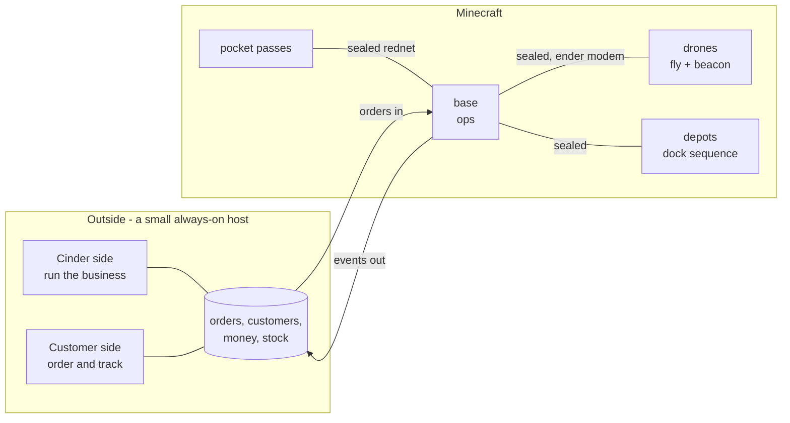

# The service outside the game

A plan, not a decision. Written 2026-09-28 after Alex: "I almost think this
needs to start running out of MC... we are going to need a Cinder-facing side
too, and customer. Unsure about the split right now, but let's plan for it."

The flying has to stay in Minecraft. The business does not. Orders, customers,
prices, money, stock and anything a person looks at outside the game would be
better on a real machine: no 1 MB ceiling, a real database, customer
coordinates off the public repo, and a website and a Discord bot living next to
the order book instead of squeezing through CC's http rules.

What is worth deciding **now** is small: the line between the two, and the
messages that cross it. Build the in-game order book to that contract today
and the split, whenever it happens, is only a change of where messages come
from.

## The shape

The base is the bridge, now and later. It is the only thing that holds the
fleet's keys and the only thing that can make a drone move. It dials out to
the service over a websocket (CC:Tweaked has `http.websocket`), so nothing on
the internet has to reach into the Minecraft server.

## What lives where

| | in the game | outside |
|---|---|---|
| flight control, beacon, touchdown, the latch | yes - it touches blocks | never |
| the dock sequence, loading, the drop | yes | never |
| turning an order into runs, running each leg | yes - the base flies it, and must keep flying if the link drops | sees it happen |
| **the order**: who, what, where, price, paid, status | today | **the home of it, after the split** |
| customers, logins, history | pass names today | yes |
| money | ledger.csv today; Numismatics is in game | the record; payments still start in game |
| stock | the depot reads it | the page shows it |
| the fleet map, incidents, stats | the control board | a web page reading the same events |

## The one rule: outside speaks in orders, never in flight commands

The service may say *deliver 10,000 cobble to 1200 70 340*. It may never say
*fly to this point*, *release the sticker* or anything else `ops.fly` carries.
Every order it sends goes through the same checks a typed one does - a known
place or coordinates inside the border with a ground height, fits in two
silos, a depot that has the goods - and the base refuses anything that fails.

So the worst a compromised service can do is create orders the base would have
accepted from Alex anyway. It cannot fly a drone into a mountain. `ops.fly`
stays in game, for the control board only.

The one exception, and it fails safe: **suspend.** Cinder staff can stop the
fleet taking new work from the web. Stopping is always allowed; starting is
not.

## Who owns what

- **The service owns the order**: its record, its status, what the customer
  sees.
- **The base owns the leg in progress**: the flight or load happening right
  now. It is the only thing that can run it, so it must be able to finish it
  with the link down.
- **Machines own their own state**, as they do today (`.dockstate`, the
  flightlog), and report it.

## The contract

The messages that cross the line, in the same dotted style as `lib/fleet.lua`.
Every one is sealed with a base-service key (made with `seckey`, like any
other), carries a nonce, and is acknowledged.

**Service to base**

| message | fields |
|---|---|
| `order.new` | id, kind, who, item, amount, to (place or x y z), price |
| `order.cancel` | id, why |
| `fleet.suspend` / `fleet.resume` | why |

**Base to service**

| message | fields |
|---|---|
| `hello` | base version, units and depots it can see, open orders it holds |
| `order.accepted` / `order.refused` | id, runs, why |
| `leg.started` / `leg.step` / `leg.done` / `leg.failed` | order, leg, machine, detail |
| `unit.tlm` | unit, x y z, phase, battery - thinned to one every few seconds |
| `unit.distress` | unit, x y z, why |
| `payment` | who, amount, order, how |
| `stock` | depot, item, amount, rate (back burner) |

**Today, before any of this exists,** `ops order add` builds an `order.new`
exactly as the service would and hands it to the same code. That is the whole
trick: the order book is written against the contract from the first line.

## When one side is down

**The service is down.** The base keeps flying every leg it already has and
writes every event to an outbox. When the link returns it replays the outbox;
events are append-only, so replaying twice is harmless. New orders cannot
arrive from outside, but `ops order add` still works in game.

**The base is down** (a restart, a chunk unload). The service marks the fleet
unreachable and the customer side says SERVICE SUSPENDED. Orders stay queued.
When the base reconnects it sends `hello` with what it holds, and the service
reconciles - the same resume ORDERS.md plans for a restart.

Neither side ever throws away what the other has not acknowledged.

## The Cinder side

Run the business. Staff only.

- **Orders.** Incoming requests, quote (the `ops quote` arithmetic: runs,
  flight time from `64 s + distance / 171`, suggested charge), accept, cancel,
  mark paid.
- **Fleet.** A live map: every unit, its phase, battery and current job.
- **Incidents.** Distress calls and silent units, with a position to recover
  from - what `incidents.csv` holds today.
- **Money.** The ledger, and what is unpaid.
- **Places.** Pads and docks, and the surveyed ground height of each.
- **Stats.** The `fleetstats` numbers, so a tuning change is judged on a page
  rather than in a terminal.
- **Suspend.** One button.

Roles when there is more than one person: owner (everything), dispatcher
(orders and fleet).

## The customer side

Order and track. Written in the Directorate's voice: terse, formal, a shade
colder than a transit company would be.

- **What we sell.** The supply list, what is in stock, what a run carries.
- **Request an order.** A customer asks; Cinder quotes and accepts. Still the
  middle man, just without the Discord message.
- **Track an order** by its id: status, and the unit's live position on the
  way in, with an ETA from the trip-time model.
- **History and balance.**
- **Terms, stated first.** Transit and cargo are at the customer's own risk and
  nothing is refunded (Alex, 2026-09-28). Said plainly before anyone orders,
  not discovered after.

Customers never see other customers, the fleet's internals, or where a depot
is.

Identity is not decided. Discord login is the obvious one - it is where the
customers already are - with their Minecraft name kept for delivery.

**Pocket passes keep working unchanged.** The base is their bridge too. The
website and the pocket become two front doors to the same orders.

## In order

Read before write, and Cinder before customer: nothing outside can cause a
flight until the read-only version has shown the contract holds.

0. **Now, in game.** Build the order book (ORDERS.md) against this contract.
   `ops order add` produces the same `order.new` the service will send. No host
   needed and nothing wasted if the split never happens.
1. **Cinder side, read only.** The base pushes events; a page shows orders, the
   fleet and incidents. Nothing outside can make anything move.
2. **Cinder side writes.** Accept, cancel and mark paid from the web. The
   service sends `order.new`; the base checks it exactly as it checks a typed
   one.
3. **Customer side, read only.** The supply list, and tracking an order by id
   with the live position.
4. **Customer side requests.** A customer asks, Cinder quotes and accepts.
5. **Notifications.** A Discord message when a delivery lands.

## Decided and not

**Decided** by writing this down, unless Alex disagrees: where the line is; the
service speaks in orders and never in flight commands; the base owns the leg in
progress; read before write, Cinder before customer.

**Not decided, and nothing needs it until step 1:** whether to split at all;
which host; which stack; how customers log in; whether a customer can ever
order without Cinder accepting it first.

## What step 1 needs that we do not have

- An always-on host with HTTPS. Alex wants 24/7 and his PC is not always on; a
  small VPS is plenty for this.
- A base-service key.
- One `wget` from the base to the host, to confirm the server's CC http
  settings let it out. GitHub works, so it probably will.
