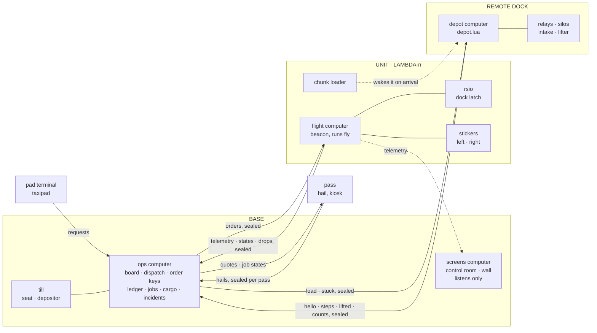
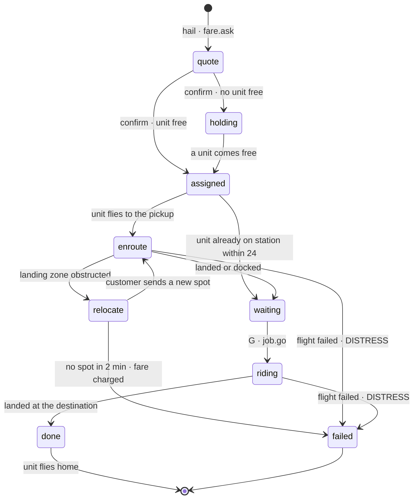
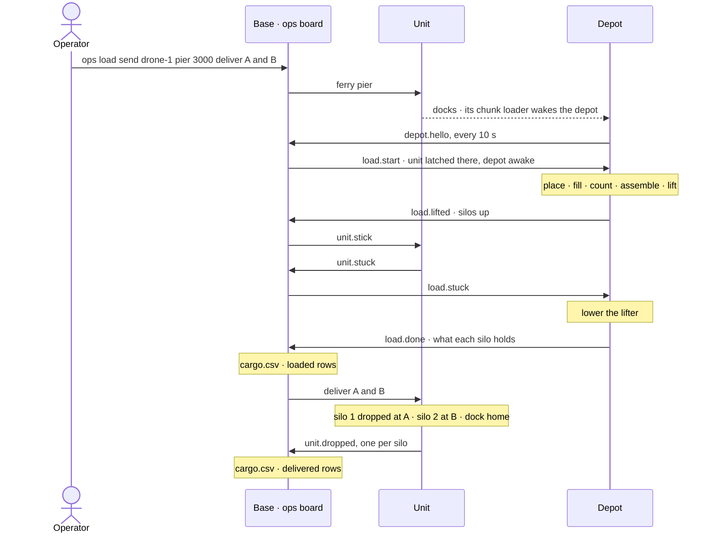
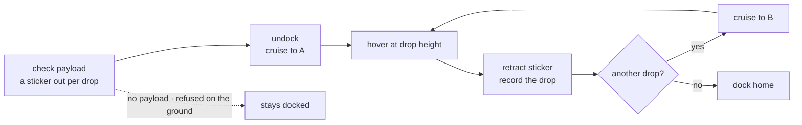
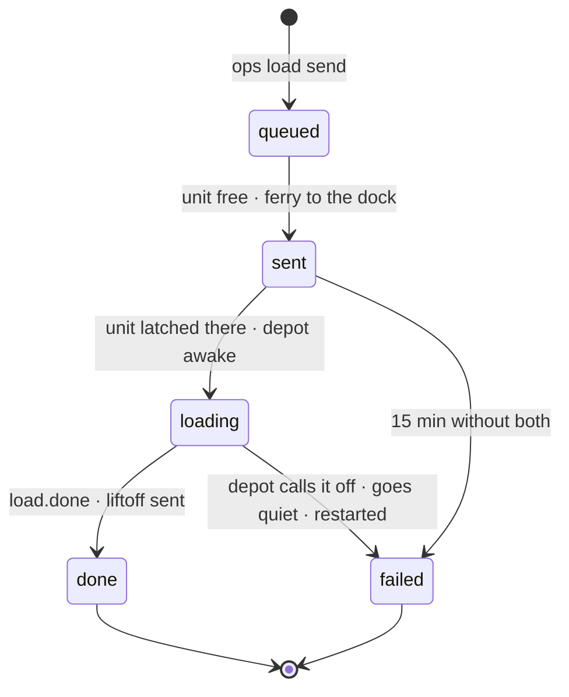
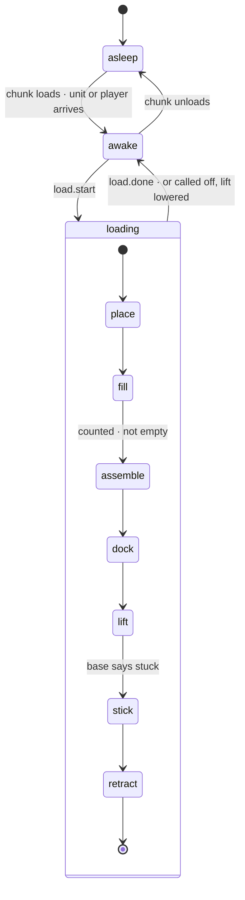
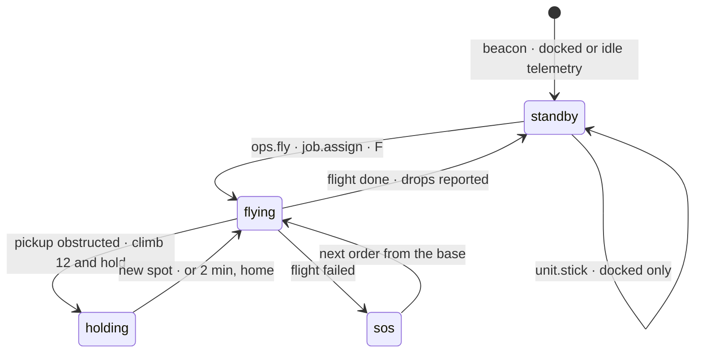

# System map

How the pieces of the service fit together: the computers, what each sends to whom, and the states a ride, a load, a depot and a unit go through. The diagrams are Mermaid, so GitHub draws them.

Generated at 4fe8d06 by `python tools/make_system_map.py`: edit the diagrams there, not here.

## Who talks to whom

One authority. The ops computer holds every order key and decides everything; the screens only listen, depots only work their machines, passes only ask.

## A ride

The job a pass follows from hail to home. Holding is the queue when every unit is busy.

## A delivery from a depot

Queued at the base; the unit's arrival wakes the depot; the base passes every message between depot and unit.

## The delivery flight

What fly deliver does once it lifts off. One silo per drop, the first sticker by name at the first drop.

## A load, as the board sees it

One load per depot at a time. Nothing waits: the board looks every second and each message moves it on.

## A depot

Asleep until its chunk loads. A restart part way through a load lowers the lift and the board calls it off.

## A unit

beacon runs while the unit is not flying and starts every flight; fly is never started on boot.

## The links

| Link | Between | How |
|---|---|---|
| Orders | base to unit or depot | sealed with that computer's key; only the base holds them |
| Telemetry and reports | unit or depot to base | sealed; the counter only rises, so a copy is refused |
| Hails | pass to base | sealed with the pass's own key; a pass can only ask |
| Quotes and job states | base to pass | plain radio; they tell, they never command |
| Wake | unit to depot | no message: the unit's chunk loader loads the depot's chunk |

## The records

| File | On | Written by | What |
|---|---|---|---|
| `ledger.csv` | base | ops | every credit and fare; a balance is the sum |
| `joblog.csv` | base | ops | every finished ride: who, where, blocks, wait, ride time |
| `cargo.csv` | base | ops load · the board | what went into each silo, and where each was dropped |
| `incidents.csv` | base | ops | every unit that went down or silent, with its position |
| `loads.queue` | base | ops load send | loads waiting for the board to pick them up |
| `.fleetkeys · .custkeys` | base | seckey · provision | keys for every unit, depot and pass |
| `pads.lua` | base · units | ops place · fly pad | docks and pads, by name |
| `station.lua` | each depot | by hand | the loading station: relay faces, silos, stickers, waits |
| `.depotstate` | each depot | depot | the step of a load under way, for after a restart |
| `.drops · .drops.log` | each unit | fly · beacon | silos let go of; reported to the base, a copy kept |
| `.dronekey` | units · depots | seckey | this computer's own key |
